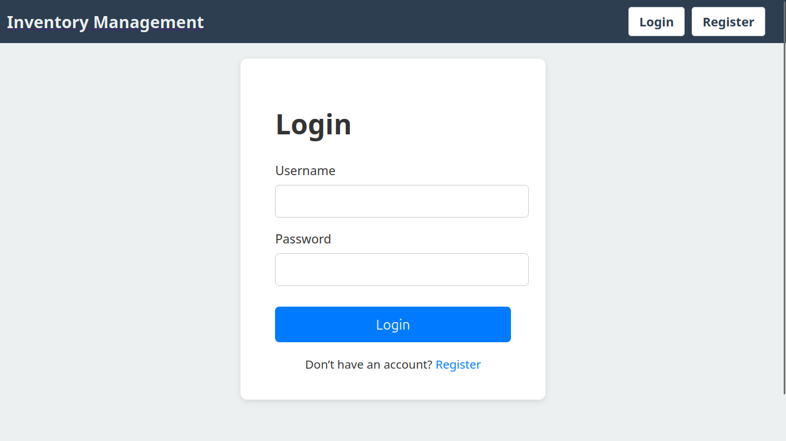
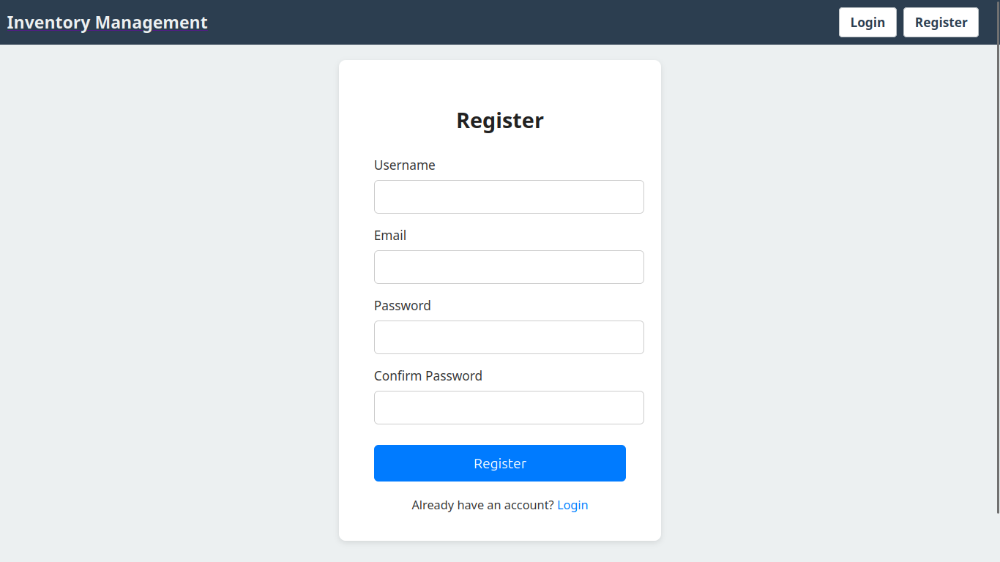
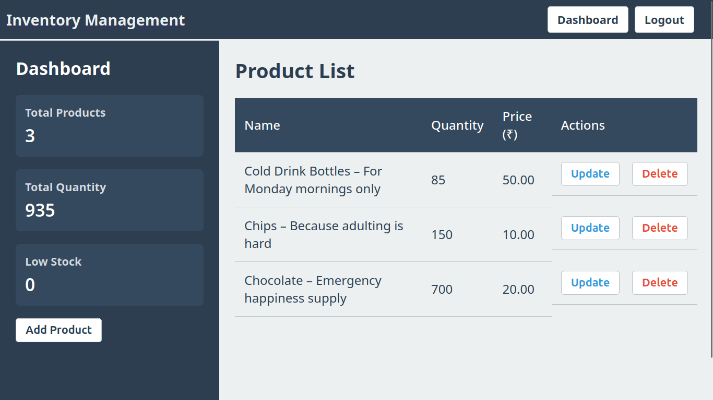

# Simple Inventory System (Django)

This is a lightweight, personal-use inventory system built with Django.
The goal of this project was to refresh core Django fundamentals and rebuild the workflow from scratch — models, forms, views, authentication, and template structure — while keeping the app simple enough for daily use.

It also serves as a practical reference project for a friend who is currently learning Django.

---

## Project Overview

The system allows each user to manage their own products.
Nothing is shared — every account has a private inventory. The interface is intentionally minimal to keep the focus on functionality and readability of the codebase.

> here `users` and `inventory` are apps

### Key Features

- **Private user inventories** — users only see their own items.
- **Clean and mobile-friendly UI** — works well on both desktop and mobile.
- **Basic authentication** — login, logout, and user-specific dashboards.
- **Straightforward product management** — add, edit, and delete.
- **Supports multiple users** without conflict.
- **Great for learning Django** — demonstrates a clean flow of models → views → templates.

---

## Project Screenshots

### User Login



### User Register



### Dashboard



### Update Product (`Add Product` is similer to this)


---

## Environment Setup

```bash
# Create and initialize virtual environment
uv init .venv

# Install dependencies from pyproject.toml
uv install
```

---

## Running the Project

```bash
# Create Django project
django-admin startproject myproject
cd myproject

# Create app
python manage.py startapp users

# Apply migrations
python manage.py makemigrations
python manage.py migrate

# Optional: Create superuser for admin access
python manage.py createsuperuser

# Start server
python manage.py runserver
```

---

## Contributing

This is a small learning project, but improvements, suggestions, and pull requests are always welcome.
